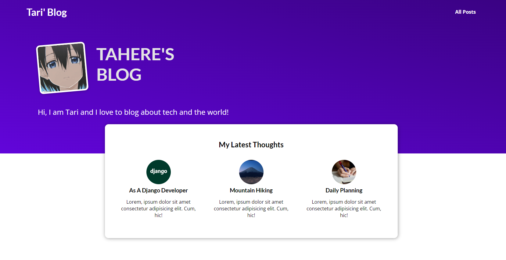

# My-Blog
A Django blog with database and login/register functionality

An ongoing project which gets compeleted setp-by-step

So far...

This blog can interact with database and read data from it.

To start this project:

1- Fork this project on you github

2- Clone it on your system

3- No special packages need to be installed

4- Run the following codes in your terminal (if on VSCode, the address is already this project folder but if in windows terminal, you should dive into this project folder first)

- Diving into the project folder
`cd [project-folder]`

- Start the developement server
`python manage.py runserver`

- To minapulate the data in database, create a superuser and add your own data
`python manage.py createsuperuser`

